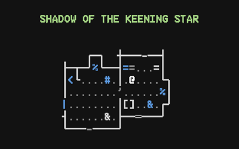
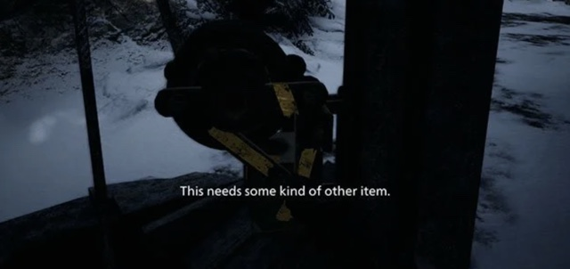
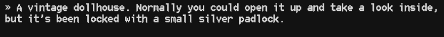
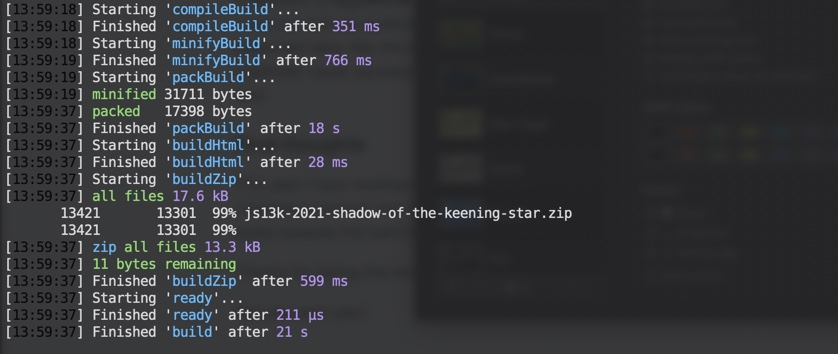

# js13k-2021-keening-star

> My 2021 entry for the js13kgames competition, Shadow of the Keening Star.



## INSTRUCTIONS

In this retro text-based puzzle adventure game, you've been led to an abandoned New England house by a mysterious letter. Will you find your missing uncle? Or will you end up pulling on the very threads of space and time itself?

Use your arrow keys to explore and interact. Press H in-game for more help.

## TOOLS USED

 - Code: [Visual Studio Code](https://code.visualstudio.com/)
 - Pixel art (font): [Aseprite](https://www.aseprite.org/)
 - World (map): [Tiled](https://www.mapeditor.org/)
 - Audio (music): [PICO-8](https://www.lexaloffle.com/pico-8.php)

## BUILDING

To build the game yourself:

```console
npm install
gulp build
```

To build with all optimizations and roadroller, for submission:

```console
gulp build --dist
```

(Distribution build takes another ~15 seconds.)

## CHANGELOG

#### v1.0.0 (2021-09-13)

 - Final version for game jam.

## POST MORTEM

### Inspiration

It's been bouncing in my head for a couple years now that I wanted to make a very text-based game. Games like [Rogue](https://en.wikipedia.org/wiki/Rogue_(video_game)) and [Kingdom of Kroz](https://en.wikipedia.org/wiki/Kroz) are some of my earliest video game memories, and I can't even count the number of hours I spent playing [ZZT](https://en.wikipedia.org/wiki/ZZT), beating levels from other players and trying to create my own.

In particular I was really taken with the idea of a game that had the interface and map of a Roguelike, but "narrated" each room you entered and all the actions you took as if it was a text adventure game like [Zork](https://en.wikipedia.org/wiki/Zork). I'm pretty pleased that although the game is much smaller and shorter than I envisioned, I think I did get to make what I wanted.

The story bouncing around in my head was 3-4 times longer than this entry and borrows a lot from Lovecraft's creatures - Azathoth, Yidhra, Nyarlathotep (referred to only as N), etc. Normally the idea would be to let things get progressively stranger, fully
leaning into the cosmic horror as you got into the second and third acts. Unfortunately due to space, I really had to only hint
at the horror elements that would eventually make up the bulk of the story.

### Gameplay

I've been playing a lot of Resident Evil 7 and 8 this past year and surprisingly, that was my biggest inspiration gameplay-wise.
For example: originally, you would "move" into objects to pick them up, and "move" into other objects to use anything in your
inventory. This seemed streamlined, but it barely felt like a game at all, especially after I had to leave enemies and combat
on the cutting room floor.

By always having waiting objects open an inventory screen, I got to do two things -- one, give more chances for players to stumble
into and read lore text on items they picked up, and two, give the player the illusion of choice. The player has to CHOOSE
to use the iron knife on a door, and even if it's the only and obvious choice, it feels like the player figured something out.
(This is a trick Resident Evil uses well I find -- even though almost all doors and mechanisms have exactly one obvious way
to use them, you still feel an "aha!" moment when you find the matching key or matching lever and backtrack to use it.)



Another thing I picked up from RE8 in particular was the idea of color-coding interactable objects. By coloring objects
you haven't investigated yet as blue, items you've investigated but aren't finished with as yellow, and objects that
are no longer interesting as gray, it takes a lot of the guesswork out for the player -- they don't have to remember which
shelf they looked at or which doors haven't been unlocked yet. Without the color coding the game would be "harder" --
but only in a way that annoys the player, not in a way that adds any kind of gameplay.

With about a week left in the competition, I realized I had to make some deep cuts, and I chose to implement an actual
story-based introduction (welcome screen) and outro (goodbye screen), and to connect the puzzles together a little more, making
a very short but consistent adventure game. I had to drop the "hit and miss" D&D combat I had planned, as well as plans for other
types of puzzle mechanics (classics like: interact with these objects in the right order, stand on the pressure plate, unlock
a padlock by finding the right code, etc.). My reasoning was that for sure there will be much better puzzle games than this one,
and for sure there will be games with much better combat; so, I'll lean into the story (text) aspect of this game, because
that's what makes it unique.

### The Font

To emulate the old text-mode games, I wanted a classic 8x16 pixel font -- but ideally with a little horror character. After
searching for quite a while, I stumbled into Robey Pointer's [Bizcat](https://robey.lag.net/2020/02/09/bizcat-bitmap-font.html)
font (CC4.0), which struck me as just about perfect -- adding a few pixels here and there to vertical lines in all the letters
gives the text a jagged, uneven feel that would look at home in a game about vampires -- or in my case, cosmic horror.

For fun I named my variant "Bizcat Knife", due to its more jagged appearance, although I'm not sure I'll get to use it again.
(Typically your font is vying with your other art assets for space, and 8x16 for every character is a lot of art, 4x5-5x6
is more typical for a pixelated font in js13k.)



### World building

I learned an incredible amount (mostly about what _not_ to do) while trying to build out the world for this game. This year
for map building I went back to Tiled. In the screenshot below you can see that I can use my font sheet to "paint" the
world using my custom font as tiles, and then on top, I can lay the positions of rooms and objects.


Unfortunately, I found editing text in Tiled a bit annoying, especially with text like I was writing -- multi-line descriptions
of items where I often wanted to control the exact spacing of each line. So instead, I created a
[giant YAML file](https://github.com/elliot-nelson/js13k-2021-keening-star/blob/60c60346a0e4b3b446a99aa5ba5e88a1dda90e79/src/assets/world.yaml)
containing all the strings in the game. In my workflow I'd add an entry in the YAML file for a new thing (perhaps `$F_STATUE`),
then in Tiled I can decide where I want `$F_STATUE` to go on the map. Having all the text in one big file like this definitely
made it easier to search, and I'd often write out the descriptions of a room and everything in it and then sort them into
individual entries.

As for how objects _behaved_, I went very low-tech -- almost everything about the gameplay is in a big
[series of if statements](https://github.com/elliot-nelson/js13k-2021-keening-star/blob/60c60346a0e4b3b446a99aa5ba5e88a1dda90e79/src/js/Player.js#L154) in the `Player` class. Near the end I began experimenting with categorizing objects so I didn't have
to add them into the big logic method -- a `TYPE_EXAMINE_ONLY` type, for example, meant you just looked at it and that was it.

A next step might be to code up more common interactions -- for example, a very common pattern is "interact with door,
interact with door again to open inventory, pick the right item and the door opens". Having a type `LOCKED_DOOR`, with a
value for `required_item: $I_IRON_KNIFE`, could also reduce some if statements.

### Audio

This year I did something totally different with audio. Instead of using the ZzFX & ZzFXM libraries, I used Cody Ebberson's
[pico8-music](https://github.com/codyebberson/pico8-music) library. I wrote my song in the PICO-8 music tracker, and then in
[my gulp build](https://github.com/elliot-nelson/js13k-2021-keening-star/blob/60c60346a0e4b3b446a99aa5ba5e88a1dda90e79/gulpfile.js#L83-L92), it transforms it into a little JS module that can be used in-game.

I really enjoyed this process; there's some really nice tutorials out there already on making music in PICO-8, as it's a
relatively popular retro game maker, and it was fun to play around in the retro sfx and music editor.

There are some cons: there's still some bugs with the library (I was never quite able to get sound effects working right,
for example, and did not end up including them), and technically the PICO-8 sfx and music system is _more_ restrictive than
ZzFX. But with a little more experimentation I can definitely see it being an option for future js13k games.

### Saving space

Fitting this much text into a 13 kilobytes proved to be pretty difficult. At this point I'm an old hand at space-cutting
measures, but I did learn a couple new ones this year.

I started out having object id's as strings, which eats a lot of space, because those raw identifiers like `DRAWING_ROOM`
are all in your final code. To avoid this, I ended up giving the IDs special names like `$D_CLOSET` and then wrote a
custom build step that would let `terser` mangle all my names, and then replace any strings with the same names with
the mangled values. However, in the end, I stumbled upon a much better way -- I ripped out this use of the terser
name cache and instead I _generate_ export constants for all my object ids in [my generated WorldData file](https://github.com/elliot-nelson/js13k-2021-keening-star/blob/60c60346a0e4b3b446a99aa5ba5e88a1dda90e79/src/js/WorldData-gen.js). This
is even better because since the constant `$D_CLOSET` now has the constant value `46`, terser can actually remove
the variable altogether and just insert the number `46` anywhere it was used. This was a big space saver.

In addition to aggressive property mangling and the above object id trick, for the last 1000 bytes of space or so,
I ended up adding [roadroller](https://lifthrasiir.github.io/roadroller/) into my build and it worked like a charm.
I tried several different ways of manually compressing / streamlining some of my patterned data, like the audio
music tracks and the map tile data, but typically my efforts would net me _maybe_ 50-100 bytes back, whereas
roadroller could squeeze out another 1000 bytes. It turned out better to just let roadroller take care of the final
"packing" -- it's an impressive tool!



### Final thoughts

This year I have newfound appreciation for video game writers. It turned out that painting the kind of slow,
skittering descent into horror that I wanted to portray was just as hard with words as it was with pixels. Plus
the added pressure that every word I added was another couple bytes towards the hard limit. So good on you,
video game writers!

Thanks for taking the time to try out my game, and if you've made it this far, for reading this post-mortem.

See you next year!
